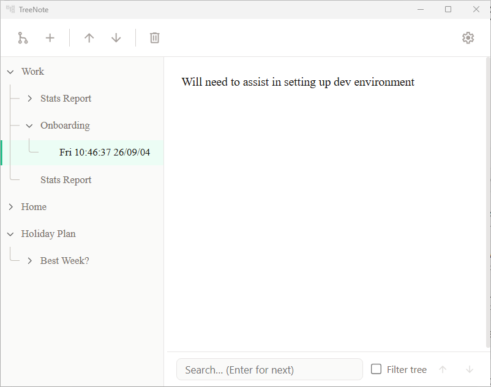

# TreeNote - Alpha (still testing; risk of data loss)

A minimalist plain-text note-taking app with your notes organised in a tree.

Built with Tauri and SQLite. See [DEVELOPERS.md](DEVELOPERS.md) for technical details.

## Features

- **Tree Structure**: Organize your notes hierarchically in a tree, up to 20 levels deep. Existing or imported notes deeper than that still open.
- **Plain Text Editing**: Simple text notes, nothing fancy
- **Drag and Drop**: Easily reorganize your notes by dragging nodes
- **Persistent Storage**: All notes are automatically saved to a local database
- **Responsive Layout**: Adjustable split view between tree and note content

## Install

1. Open the latest [GitHub release](https://github.com/ldbiz/treenote/releases).
2. Download **treenote-0.2.0-setup.exe**.
3. Run the installer. Installation is per-user and does not need administrator access.

After setup, TreeNote is in the Start Menu. The installer can also add a desktop shortcut. TreeNote keeps its settings, notebooks and backups together in one data folder. The default is TreeNote's AppData folder, and a different data folder can be chosen during first setup.

## Usage

- **Create Notes**: Use the toolbar to create a new root node (tree icon) or a child of the selected node (plus icon). Child creation requires a selected node.
- **Edit Notes**: Select a node and edit its content in the right panel. Changes autosave.
- **Organize Notes**: Drag and drop nodes to reorganize your tree, or use the toolbar Move Up/Down buttons. Reordering is saved automatically.
- **Rename Nodes**: Long-press on a node label to rename it, press **F2**, or right-click and choose **Rename**.
- **Keyboard (tree)**: With the tree focused, **Up/Down** move among visible notes, **Left/Right** collapse/expand or move to parent/child, **Home/End** jump to the first/last visible note, **Page Up/Down** jump by a page, **Delete** deletes the selected note (with the same confirmation as the toolbar), **Enter** focuses the editor, and **Tab** / **Shift+Tab** leave the tree to the splitter or toolbar (the tree is one tab stop).
- **Delete Notes**: Select a node and use the delete button in the toolbar, press **Delete**, or right-click and choose **Delete**. Deleting a node with children asks for confirmation.
- **Duplicate Branch**: Right-click a node and choose **Duplicate** to copy it and all descendants as a sibling named `Copy of …`.
- **Export Branch**: Right-click a node and choose **Export** to save that branch as JSON via a Save dialog. A temporary notification shows the saved path.
- **Search**: Use the search bar at the bottom of the editor. Press Enter to search or move to the next match. Use the up/down buttons to step through results, and optionally enable **Filter tree** to show only matching branches.
- **Options**: Open the settings window from the gear icon to change theme and editor font, view note/tree counts for the open notebook, switch or create notebooks, restore from a backup, set an app-lock password, or import/export via Obsidian, Joplin, TreeNote JSON, or Flashnote.

### Conversion

From **Settings → Conversion**, you can import notes into a new TreeNote notebook (`.sqlite3`):

- **Obsidian** — select an Obsidian vault (or any folder of Markdown notes).
- **Joplin** — select a **Markdown** or **Markdown + Front Matter** directory export (not JEX/RAW).
- **TreeNote JSON** — import from or export to TreeNote-formatted JSON.
- **Flashnote** — import from or export to a Flashnote `.db` backup.

Conversion preserves note titles, plain-text bodies, and parent/child hierarchy only. Formatting, images, attachments, and application-specific metadata are not preserved. Imports may already be deeper than 20 levels; those notes are kept.
